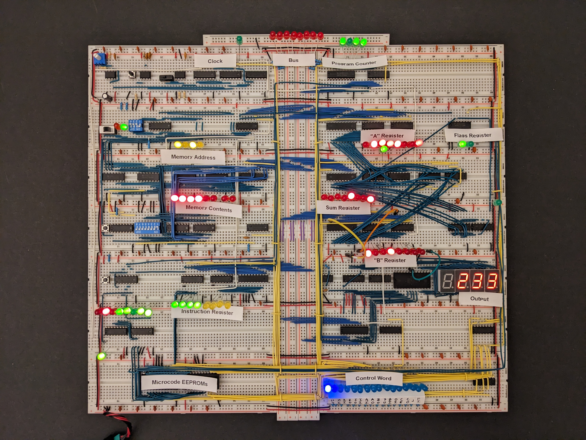

# 8-bit Breadboard Computer

https://eater.net/8bit

Ben Eater created an incredible series of videos and kits about building an 8-bit computer on breadboards; he takes “I built my own computer” to the next level.

I ordered his kits, followed along, and built my own. It took me about a month, and through the process I learned a LOT about digital electronics. Though I have to admit, it feels like 95% of the effort was in trying to keep wires organized :)

## Final Result



## Modifications / Optimizations

I made a few modifications / optimizations; most of them were inspired by helpful YouTube comments and Reddit posts:

- Used LEDs with built-in resistors, which saved a lot of space
- Upgraded from a generic power supply to a much more reliable Apple one
- Passed clock signal through a “double buffer” (aka two inverters) before connecting it to the RC circuit, to avoid “bouncing”
- Added lots of extra pull-up resistors to avoid floating voltages
- In the output display, suppressed leading 0's and put the minus sign immediately in front of the value (instead of always at the leftmost position)
- Used 1kΩ instead of 10kΩ for bus pulldown resistors

## Fibonacci Program

The video included in this directory (that shows the computer calculating Fibonacci numbers) is running the following program:

```
Address   Machine Code    Assembly
----------------------------------
 0        0001 1111       lda 15
 1        1110 0000       out
 2        0010 1110       add 14
 3        0111 1010       jc  10
 4        0100 1101       sta 13
 5        0001 1111       lda 15
 6        0100 1110       sta 14
 7        0001 1101       lda 13
 8        0100 1111       sta 15
 9        0110 0000       jmp 0
10        1111 0000       hlt
11        -
12        -
13        -
14        0000 0001       1
15        0000 0001       1
```
