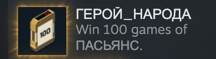

# EXAPUNKS Solitaire Solver

[EXAPUNKS](https://store.steampowered.com/app/716490/EXAPUNKS/), a fantastic Zachtronics game, includes a (fairly difficult) Solitaire mini-game. There’s a Steam achievement for winning 100 times, and I want the achievement... but I do NOT want to sit there and play 100 games... so I wrote a script to automate the process.

Because the game displays cards in a pixel-perfect way, I didn’t need to do any fancy computer-vision. To determine what the cards were, I could just take a screenshot and compare pixels at a known location to reference images.

As for actually solving the game, the main challenge was representing the state of the game; from there it was enough to just do a straightforward graph search.

It’s a relatively brittle solution with quite a bit of hardcoding, but it was enough to get the job done :)

## Achievement Unlocked!

## Video

