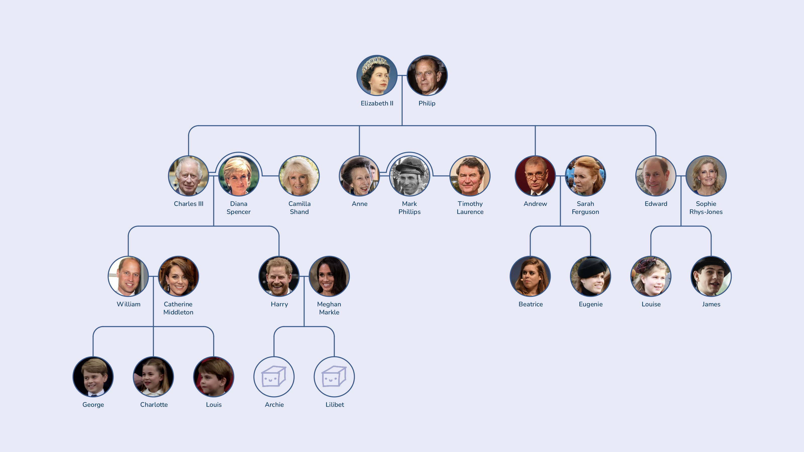

# Family Tree

My significant other has rather a lot of cousins (over 20), and I wanted a nice way to make a family tree so I could see all of their names and faces at a glance.

After seeing the final result, the boyfriend of one of her cousins said “This should be included in the boyfriend onboarding!”

## Notes

- This was mostly a layout challenge; the hardest part was handling multiple spouses.
- There's also a Python script that crops square images into circles (with a transparent background).
- This is a case study in how NOT to do reliable / maintainable / high-quality software engineering!

## Example



## Syntax

```python
tree = Node('Elizabeth II',
           Spouse('Philip',
               Node('Charles III',
                   Spouse('Diana\nSpencer',
                       Node('William',
                           Spouse('Catherine\nMiddleton',
                               Node('George'),
                               Node('Charlotte'),
                               Node('Louis'))),
                       Node('Harry',
                            Spouse('Meghan\nMarkle',
                               Node('Archie'),
                               Node('Lilibet')))), rsqueeze=True),
               Node('Charles III',
                   Spouse('Camilla\nShand'), duplicate=True),
               Node('Anne',
                   Spouse('Mark\nPhillips')),
               Node('Anne',
                   Spouse('Timothy\nLaurence'), duplicate=True),
               Node('Andrew',
                   Spouse('Sarah\nFerguson',
                       Node('Beatrice'),
                       Node('Eugenie'))),
               Node('Edward',
                   Spouse('Sophie\nRhys-Jones',
                       Node('Louise'),
                       Node('James')))))
```
