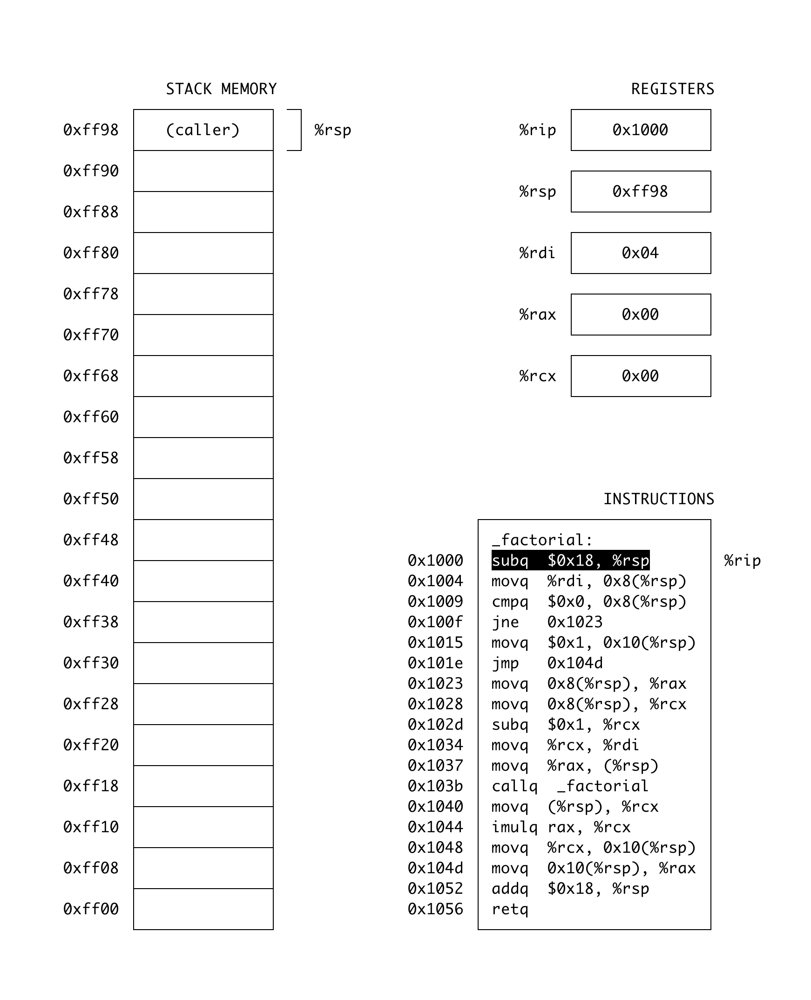

# x86 Visualizer

When I teach computer science courses, students often struggle with understanding x86 assembly and how the “stack” works. Even though no individual part is that complicated, there are just so many things to keep in your head that the whole thing can be very overwhelming.

I implemented a terminal program (using the `ncurses` library) that shows the state of registers and memory as you step through each assembly instruction of a simple function. Yes, `factorial` is hardcoded :)

I use this visualizer as a teaching aid as I explain all the relevant concepts. It usually takes about 90 minute to go through the whole thing, explain all the various pieces, and answer questions that come up.

As a bonus, many students tell me that they come away with a much better understanding of recursion as well.

## Screenshot

